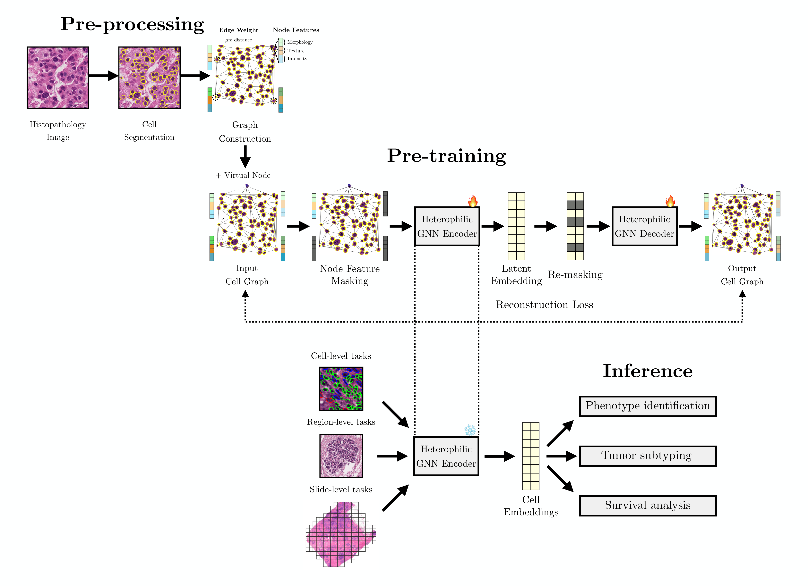

<table>
<tr>
<td width="140" align="center">

</td>
<td>
<h1>GrapHist: Graph Self-Supervised Learning for Histopathology</h1>
This repository contains the pre-processing, pre-training, and inference steps for GrapHist, a graph-based self-supervised learning framework for histopathology.
<br/><br/>
<a href="https://huggingface.co/ogutsevda">🤗 Models & Datasets</a> contain the pre-trained model weights and the constructed digital pathology graph datasets.
</td>
</tr>
</table>

<p align="center">

</p>

## 🚀 Installation

### Environment Setup

```bash
# Create a conda environment from the provided yaml file
conda env create -f env.yaml
conda activate graphist
```

### Dependencies

Key dependencies include:
- PyTorch 2.2.2 with CUDA 11.8 support
- PyTorch Geometric 2.5.2
- TensorFlow 2.x (for StarDist)
- StarDist for cell segmentation
- OpenSlide for WSI processing
- scikit-learn, pandas, numpy

## ⚙️ Repository Structure

```
graphist/
├── env.yaml                    
├── README.md    
├── LICENSE.md                 
├── figs/                   
│   ├── graphist_logo.png
│   └── graphical_abstract.png
└── src/
    ├── data/                   # Data preprocessing scripts
    │   ├── 01_cell_segmentation.py
    │   ├── 02_cell_feature_extraction.py
    │   ├── 03_graph_construction.py
    │   ├── 04_save_dataset.py
    │   └── utils.py
    ├── train/                  # Model training scripts
    │   ├── pretrain.py         
    │   ├── generate_embs.py    
    │   ├── utils.py
    │   └── models/             # Model architectures
    │       ├── acm_gin.py      
    │       └── edcoder.py      
    └── evaluate/               # Evaluation scripts
        ├── main_slide.py       
        ├── main_patch.py      
        ├── main_cell.py        
        ├── survival_analysis.py
        ├── utils.py
        └── mil/                # MIL classifiers
            ├── additive_mil.py
            ├── attentive_mil.py
            └── conjunctive_mil.py
```


## Pre-processing

❗ Please note that the input image datasets should be structured as follows:
```
data/
├── images/
│   ├── patient_001/
│   │   ├── patch_001.png
│   │   └── patch_002.png
│   └── patient_002/
└── clinical_data/
    ├── sample_labels.csv
    └── sample_split.csv
```

1️⃣ **Cell Segmentation**
   - Uses StarDist2D pre-trained model for cell detection
   - Extracts cell coordinates and segmentation probabilities
   - Supports multiple image formats (PNG, TIFF, SVS)

**Usage:**

```bash
python src/data/01_cell_segmentation.py \
    --input_path /path/to/images \
    --output_path /path/to/segments
```

2️⃣ **Cell Feature Extraction**
   - Computes morphological features
   - Extracts texture features using Gray-Level Co-occurrence Matrix (GLCM)
   - Calculates intensity statistics and Fourier descriptors

**Usage:**

```bash
python src/data/02_cell_feature_extraction.py \
    --input_path /path/to/images \
    --seg_path /path/to/segments \
    --output_path /path/to/features 
```

3️⃣ **Graph Construction**
   - Builds spatial graphs using Delaunay triangulation
   - Filters edges based on distance threshold
   - Creates node and edge features for graph neural networks

**Usage:**

```bash
python src/data/03_graph_construction.py \
    --feat_path /path/to/features \
    --output_path /path/to/graphs \
    --dist_threshold 100
```

4️⃣ **Dataset Preparation**
   - Converts processed data to PyTorch Geometric format
   - Handles clinical data integration
   - Prepares train/validation/test splits

**Usage:**

```bash
python src/data/04_save_dataset.py \
    --edge_path /path/to/graphs \
    --clinical_data_path /path/to/clinical_data \
    --output_path /path/to/dataset
```

❗ The output of folders should look like the following:
```
results/
├── segments/
│   ├── patient_001/
│   │   ├── patch_001_coords.npy
│   │   └── patch_001_probs.csv
├── features/
│   ├── patient_001/
│   │   └── patch_001_features_20x.csv
└── graphs/
│   ├── patient_001/
│   │   └── patch_001_edges.csv
└── dataset/
    ├── data/
    │   └── patient_001_patch_001.pt
    └── metadata.csv
```

> ⚠️ **RoI Datasets Note**: Please note that the graph datasets for BACH, BRACS, and BreakHis provided on HuggingFace are constructed from the full RoI images without patching. However, the main experiments reported in the paper were conducted using patched versions of these datasets. To replicate the exact experimental setup, please use the above scripts with an appropriate patch size on the original image datasets.

## Pre-training

- **Architecture**: Encoder-Decoder with ACM-GIN (Adaptive Channel Mixing Graph Isomorphism Network)
- **Pre-training Task**: Masked node attribute prediction
- **Loss Function**: SCE (Scaled Cosine Error) loss

**Usage:**

```bash
# Pre-training
python src/train/pretrain.py \
    --save_folder /path/to/checkpoints \
    --norm_json_path /path/to/normalization.json \
    --metadata_csv_path /path/to/dataset/metadata.csv \
    --mask_rate 0.5 \
    --replace_rate 0.1 \
    --num_hidden 512 \
    --num_layers 5 
```

```bash
# Generating embeddings (slide/patch — requires metadata.csv)
python src/train/generate_embs.py \
    --dataset BACH \
    --scale slide \
    --model_path /path/to/graphist.pt \
    --norm_json_path /path/to/normalization.json \
    --metadata_csv_path /path/to/metadata.csv \
    --output_path /path/to/embeddings 
```

``` bash
# Generating embeddings (cell — requires graph data directory)
python src/train/generate_embs.py \
    --dataset NuCLS \
    --scale cell \
    --model_path /path/to/graphist.pt \
    --norm_json_path /path/to/normalization.json \
    --cell_graphs_path /path/to/cell_graphs_path \
    --output_path /path/to/embeddings 
```

## Inference

- **MIL**: Attention, additive, and conjunctive classifiers for slide- and roi-level tasks
- **Non-Linear Probing**: Logistic regression for cell-level tasks

**Usage:**

```bash
# WSI- and RoI-level evaluation (patched)
python src/evaluate/main_slide.py \
    --dataset TCGA_BRCA \
    --label_path /path/to/labels.csv \
    --train_data_path /path/to/train_embeddings \
    --test_data_path /path/to/test_embeddings \
    --project_dir /path/to/project \
    --save_dir /path/to/results

# RoI-level evaluation (non-patched)
python src/evaluate/main_patch.py --dataset BACH
```

```bash
# Cell-level evaluation (NuCLS — fold CSVs)
python src/evaluate/main_cell.py \
    --split_mode csv \
    --emb_dir /path/to/embeddings \
    --split_csv_dir /path/to/train_test_splits \
    --save_dir /path/to/results

# Cell-level evaluation (PanNuke — fold directories)
python src/evaluate/main_cell.py \
    --split_mode folder \
    --fold_dirs /path/to/fold_1 /path/to/fold_2 /path/to/fold_3 \
    --save_dir /path/to/results
```

## 📚 Citation

If this repository is helpful to you, please consider citing the associated paper.
